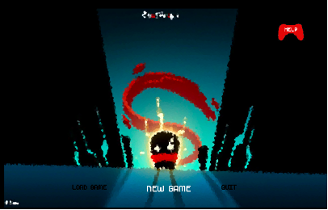
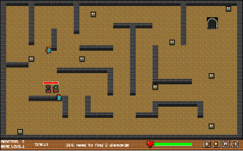
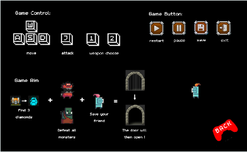
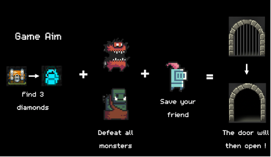
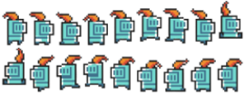
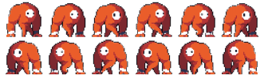
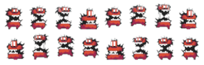
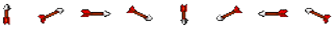

Role-playing game inspired by Soul Knight and to produce a simple 2D game using C++/SDL, focusing on the inclusion of a tile manager, animation, texturing, Object Oriented Principles (Inheritance, Interfaces etc.) and gameplay logic.

 
 

There are 5 different object classes in the game, to achieve a consistent animation, the corresponding sprite sheets are loaded. 

During the game, user can generate weapons by pressing “J” button and choose which kind of weapon to fire by press “1” (arrow) or “2” (fireball). After that, the new weapon is generated.

I added many interesting elements and designed an interesting story line:  Evil monsters have captured your friends, and you need to go to the dungeon to rescue them. The doors between levels are closed so that you need to defeat monsters in each level and acquire enough gems to open these doors. You can escape from the dungeon if you defeat the final boss. Good Luck!

File list: 

| File Name | Function|
| :----: | :----|
|Scyyz4Object .h/.cpp |	The player class, record player life and the time spent on game.|
|Ally .h/.cpp	| The characters that needs be rescued. |
|Audio .h/.cpp	| Control music play. |
|Fireball .h/.cpp 	| Fireball class, one of the weapons.|
|Weapon .h/.cpp	| Base class of weapons, the arrow and fireball can generate from this class.|
|Monster .h/.cpp	|Base class of monsters. Define some common functions of monsters.|
|RedMonster .h/.cpp	|Derived class of Monster. *, define the function of monster in the first level.|
|HellMonster .h/.cpp	|Derived class of Monster. *, define the function of monster in the second level.|
|BossMonster .h/.cpp|	Derived class of Monster. *, define the function of monster in the final level.|
|Stage .h/.cpp	|Base class of stages. Define some common functions of different stages.|
|Menu .h/.cpp	|Derived class of Stage. *, user can choice in this stage (new/load game).|
|GameStart .h/.cpp	|Derived class of Stage. *, the animation of entering the play stage.|
|GamePlay .h/.cpp	|Derived class of Stage. *, the main part of this game. Control the generation of all the objects and switch between different levels.|
|GameWin .h/.cpp	|Derived class of Stage. *. You can enter this stage and input your name if you defeat the boss. |
|GameScores .h/.cpp	|Derived class of Stage. *, the winner has chance to see high scores. But only the top six scores of player can be recorded.|
|GamePaused .h/.cpp	|Derived class of Stage. *, press the shift button to pause the game and re-press it to continue the game.|
|Scyyz4TileManager .h/.cpp	|Manage the different tiles displayed during the game.|
|Scyyz4Engine .h/.cpp	|The game engine.|

